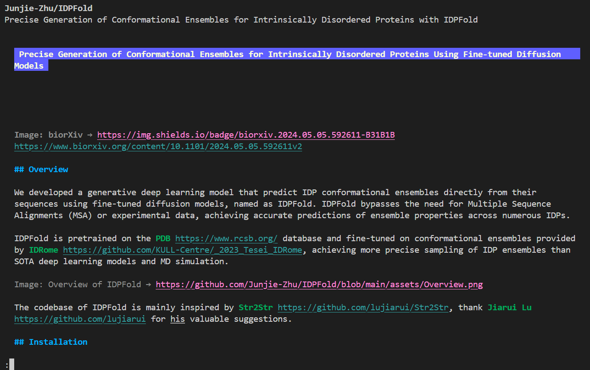
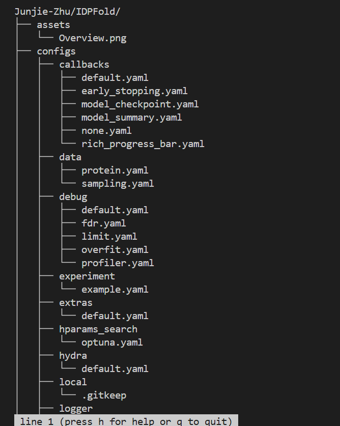
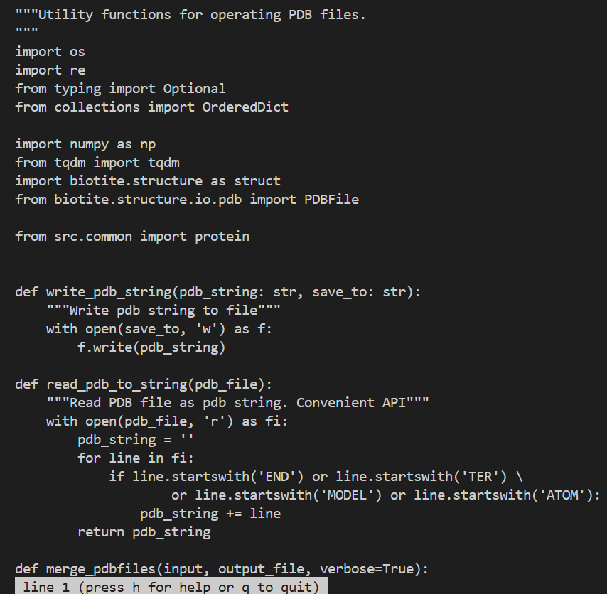
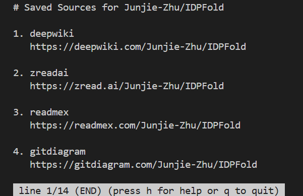

# GhResearcher 🔬

专为科研人员、开发者与技术爱好者打造的 GitHub 代码与仓库分析终端工具（CLI）。让你**无需离开终端（Terminal）**，即可追踪学术大牛动态、抓取并解析仓库上下文文件、并进行高级搜索。

---

## 目录

- [GhResearcher 🔬](#ghresearcher-)
  - [目录](#目录)
  - [📖 简介 / Introduction](#-简介--introduction)
  - [🧠 设计哲学 / Design Philosophy](#-设计哲学--design-philosophy)
  - [✨ 核心特性 / Features](#-核心特性--features)
  - [⚙️ 安装说明 / Installation](#️-安装说明--installation)
    - [环境依赖](#环境依赖)
    - [安装 GhResearcher](#安装-ghresearcher)
  - [🚀 使用指南 / Usage Guide](#-使用指南--usage-guide)
    - [1. 动态监控 (`monitor`)](#1-动态监控-monitor)
      - [监控单个用户](#监控单个用户)
      - [监控组织 / 实验室 (`--org`)](#监控组织--实验室---org)
      - [监控特定仓库 (`--repo`)](#监控特定仓库---repo)
      - [窥探大牛的视野 / 信息流 (`--received`)](#窥探大牛的视野--信息流---received)
      - [批量订阅监控](#批量订阅监控)
      - [详尽的 Commit 展示 (`--expand-commits`)](#详尽的-commit-展示---expand-commits)
    - [2. 解析仓库上下文 (`parse`)](#2-解析仓库上下文-parse)
    - [3. 多领域高级搜索 (`search`)](#3-多领域高级搜索-search)
      - [3.1 命令语法](#31-命令语法)
      - [3.2 CLI 参数完整速查](#32-cli-参数完整速查)
      - [3.3 布尔标志的两类写法](#33-布尔标志的两类写法)
      - [3.4 排序标准 --sort合法取值](#34-排序标准--sort合法取值)
      - [3.5 声明式 YAML 配置 --config](#35-声明式-yaml-配置---config)
      - [3.6 内置校验](#36-内置校验)
      - [3.7 实用场景与配置案例](#37--实用场景与配置案例)
      - [3.8 各搜索域 YAML 模板全参数详解](#38--各搜索域-yaml-模板全参数详解)
      - [3.9 提示与注意事项](#39--提示与注意事项)
  - [⏰ 动态更新自动化](#动态更新自动化)
  - [😄 Todo](#-todo)


## 📖 简介 / Introduction

**GhResearcher** 是一个极简而强大的终端工具集。它基于 GitHub REST API 和 GitHub CLI (`gh`) 开发，旨在将 GitHub 的海量信息流、仓库结构以及代码搜索带入命令行中。

无论你是想追踪某位领域专家的“朋友圈”、监控某个实验室（组织）的代码产出，还是想快速将一个庞大仓库的结构导出为供大语言模型（LLM）阅读的上下文 Markdown 文件，GhResearcher 都能通过 `Rich` 和 `Typer` 提供优美、直观且高效的终端交互体验。

## 🧠 设计哲学 / Design Philosophy

- **告别“放养”状态 (Curing Free-Range Research):** 很多研究生（特别是计算方向）常处于“放养”状态，缺乏日常指导。GhResearcher 让你像刷推特、刷“代码朋友圈”一样，时刻追踪领域内学者和大牛们的最新动向。它不仅能为你提供极佳的参考和目标，让你在科研和写代码时更有干劲，更能让你保持极强的学术参与感，确保你的精力始终跟紧主流前沿而不偏离方向。
- **终端优先 (Terminal First):** 保持心流，无需频繁切换回浏览器。
- **高信息密度 (Data Density):** 紧凑输出。长哈希值自动截断，分页无缝处理，过滤冗余信息。
- **AI 友好 (LLM-Friendly):** 诸如 `scrape` 命令，专为生成供 ChatGPT/Claude 阅读的 `.md` 上下文文件而设计。
- **隐私与安全 (Privacy & Security):** 完全依赖你本地的 `gh` CLI 凭证，无需第三方代理，不收集任何使用数据。

---

## ✨ 核心特性 / Features

- **动态追踪 (`monitor`)**: 
  - 支持追踪指定 用户 (User)、组织 (`--org`) 或特定仓库 (`--repo`) 的动态事件。
  - 支持“信息流”追踪 (`--received`)：看看大牛关注的人和仓库最近在干什么。
  - 自动处理分页，突破单次 API 拉取上限，并能对 PR/Issue/Release 生成富文本标题。
- **仓库上下文解析 (`parse`):**
    - 默认将仓库解析为一个包含项目 README、描述及全景 ASCII 目录树的 Markdown 文件(类似于tree命令)。
    - `--view` 模式下会在终端分页查看；仓库默认显示 README + 目录树。
    - `--view-mode readme` 会直接使用 `gh repo view` 的原生分页体验只看 README。
    - `--view-mode tree` 只查看目录树。
    - `--source` 会列出这个仓库的`Agent解析引擎(比如说DeepWiki或者一些基于LLM的GitHub智能解析器)`的source URL。
    - `--sources-file <file>` 用于加载额外或覆盖的`Agent解析引擎` URL 配置 JSON。
    - 支持单文件目标 `owner/repo/path/to/file`，默认直接输出文件内容，`--view` 可分页查看。
    - 除了以上解析翻页查阅外，还支持`直接下载抓取对应文件内容`。
- **多领域搜索 (`search`)**:
  - 支持在终端内直接检索仓库、代码片段、Issue 以及 Pull Request。

---

## ⚙️ 安装说明 / Installation

### 环境依赖
1. **Python 3.8+**
2. **GitHub CLI (`gh`)**: 必须在本地安装 [gh](https://github.com/cli/cli) 命令行工具，并完成账号授权。
   ```bash
   # 1. 安装 gh (以 Ubuntu/Debian 为例)
   # 参考: https://github.com/cli/cli/blob/trunk/docs/install_linux.md#debian
   (type -p wget >/dev/null || (sudo apt update && sudo apt install wget -y)) \
	&& sudo mkdir -p -m 755 /etc/apt/keyrings \
	&& out=$(mktemp) && wget -nv -O$out https://cli.github.com/packages/githubcli-archive-keyring.gpg \
	&& cat $out | sudo tee /etc/apt/keyrings/githubcli-archive-keyring.gpg > /dev/null \
	&& sudo chmod go+r /etc/apt/keyrings/githubcli-archive-keyring.gpg \
	&& sudo mkdir -p -m 755 /etc/apt/sources.list.d \
	&& echo "deb [arch=$(dpkg --print-architecture) signed-by=/etc/apt/keyrings/githubcli-archive-keyring.gpg] https://cli.github.com/packages stable main" | sudo tee /etc/apt/sources.list.d/github-cli.list > /dev/null \
	&& sudo apt update \
	&& sudo apt install gh -y

   # 2. 登录并授权你的 GitHub 账号
   gh auth login
   ```

### 安装 GhResearcher

优先推荐使用 `pip` 进行安装：
```bash
pip install ghresearcher
```

或者克隆此仓库从源码安装：
```bash
git clone https://github.com/MaybeBio/GhResearcher.git
cd GhResearcher
pip install -e .
```
验证安装是否成功：
```bash
ghresearcher --help
```

---

## 🚀 使用指南 / Usage Guide

### 1. 动态监控 (`monitor`)

`monitor` 命令提供了一个统一的 GitHub 动态时间轴，就像浏览代码的朋友圈一样。

**语法:** `ghresearcher monitor [选项] [目标]`

```python
❯ ghresearcher monitor --help
                                                                                                                                                                  
 Usage: ghresearcher monitor [OPTIONS] [TARGET_NAME]                                                                                                              
                                                                                                                                                                  
 Track and view the recent events of specific GitHub user(s), organization(s), or repos. Supports single target directly or batch targets via file. Events from   
 multiple targets are combined into a global chronological timeline.                                                                                              
                                                                                                                                                                  
╭─ Arguments ────────────────────────────────────────────────────────────────────────────────────────────────────────────────────────────────────────────────────╮
│   target_name      [TARGET_NAME]  The GitHub user, org, or repo to monitor                                                                                     │
╰────────────────────────────────────────────────────────────────────────────────────────────────────────────────────────────────────────────────────────────────╯
╭─ Options ──────────────────────────────────────────────────────────────────────────────────────────────────────────────────────────────────────────────────────╮
│ --file            -f      TEXT     File containing GitHub targets (one per line)                                                                               │
│ --received        -r               Fetch feed instead of user's own events                                                                                     │
│ --org             -O               Treat target as an Organization instead of a User                                                                           │
│ --repo            -R               Treat target as a Repository (owner/repo format)                                                                            │
│ --limit           -l      INTEGER  Number of events to fetch per target [default: 30]                                                                          │
│ --since                   TEXT     Filter events on or after this date (YYYY-MM-DD)                                                                            │
│ --until                   TEXT     Filter events on or before this date (YYYY-MM-DD)                                                                           │
│ --expand-commits                   Make additional API calls to get commit details for PushEvents if missing                                                   │
│ --help                             Show this message and exit.                                                                                                 │
╰────────────────────────────────────────────────────────────────────────────────────────────────────────────────────────────────────────────────────────────────╯
```

3个对我来说每天都要运行的重要命令(每日更新)
```python
# 你可以把输入文件改成你的目标文件

# 昨天到今天关注用户的动态事件
ghresearcher monitor -f /data2/GhResearcher/tests/target_academic_user.txt --since $(date -d "1 day ago" +%Y-%m-%d) --expand-commits

# 昨天到今天关注用户的动态事件（包含接收事件，这个输出一般会很长）
ghresearcher monitor -f /data2/GhResearcher/tests/target_academic_user.txt --since $(date -d "1 day ago" +%Y-%m-%d) -r --expand-commits

# 昨天到今天关注组织的动态事件
ghresearcher monitor -f /data2/GhResearcher/tests/target_org.txt --since $(date -d "1 day ago" +%Y-%m-%d) --org --expand-commits
```

#### 监控单个用户
追踪特定开发者的公开行为（例如：推送代码、Star 仓库、Fork 等）。
```bash
# 监控单个用户（MaybeBio）
ghresearcher monitor MaybeBio -l 5

# 批量监控多个用户（将用户名写在文件中，每行一个）
ghresearcher monitor -f users_to_track.txt 
# ghresearcher monitor -f ./tests/target_user.txt --since 2026-05-11 --expand-commits
```

执行后你将看到类似如下的输出（What you get is）：
```python
Fetching events for target(s): MaybeBio...

2026-05-12 23:12:28 | ⭐️ MaybeBio starred alchaincyf/huashu-design
2026-05-12 20:07:14 | 🚀 MaybeBio pushed to MaybeBio/GhResearcher (no commit info)
2026-05-12 19:10:24 | 🚀 MaybeBio pushed to MaybeBio/bioinfor_script_modules (no commit info)
2026-05-12 19:02:18 | 🚀 MaybeBio pushed to MaybeBio/GhResearcher (no commit info)
2026-05-12 18:59:39 | 🆕 MaybeBio created branch 'main' at MaybeBio/GhResearcher
```

如果是多个用户，输出会包含每个用户的动态事件，并按时间戳降序排列，形成一个全局时间线。

```python
Fetching events for target(s): alexholehouse, Junjie-Zhu, HFChenLab, sirius777coder, Zuricho, Immortals-33, lujiarui, ChenDdon, AspirinCode, bjing2016, tyang816, prokia, Gonglab-THU...

2026-05-13 08:50:23 | ⭐️ prokia starred yliust/Tactile
2026-05-13 03:04:54 | ⭐️ Zuricho starred jsdoc/jsdoc
2026-05-12 23:14:59 | 🚀 AspirinCode pushed to AspirinCode/awesome-AI4MolConformation-MD
    - [cc88d0d] (expanded) Update README.md
2026-05-12 22:54:36 | 🚀 AspirinCode pushed to AspirinCode/papers-for-molecular-design-using-DL
    - [c062c62] (expanded) Update README.md
2026-05-12 20:29:29 | ⭐️ sirius777coder starred aqlaboratory/genie3
2026-05-12 20:01:38 | ⭐️ Immortals-33 starred obra/superpowers
2026-05-12 19:54:51 | ⭐️ Zuricho starred nicobailon/visual-explainer
2026-05-12 19:48:18 | ⭐️ Zuricho starred RomeroLab/BioDesignBench
2026-05-12 19:17:07 | 🔹 bjing2016 performed MemberEvent on MihirBafna/boltzgen
2026-05-12 19:08:38 | 🚀 AspirinCode pushed to AspirinCode/awesome-AI4MolConformation-MD
    - [042c4c9] (expanded) Update README.md
2026-05-12 18:54:19 | 🚀 AspirinCode pushed to AspirinCode/awesome-AI4MolConformation-MD
    - [6a0bac1] (expanded) Update README.md
2026-05-12 18:50:17 | 🚀 AspirinCode pushed to AspirinCode/awesome-AI4MolConformation-MD
    - [348fb9f] (expanded) Update README.md
2026-05-12 18:24:54 | ⭐️ AspirinCode starred HealthRex/PhysicianBench
2026-05-12 16:23:29 | ⭐️ Zuricho starred yliust/Tactile
2026-05-12 16:19:36 | ⭐️ Zuricho starred smiles724/Proteo-R1
2026-05-12 09:56:57 | ⭐️ AspirinCode starred yaochenr/LLM-TPD-Extraction
2026-05-12 00:07:44 | 💬 tyang816 created issue 'Trouble recreating zero shot results on protein gym' in ai4protein/VenusREM
2026-05-11 23:30:54 | ⭐️ AspirinCode starred Yuan1z0825/nature-skills
2026-05-11 18:08:37 | 💬 Junjie-Zhu created issue 'Availability of pretrained weights' in Vincentx15/atomsurf
2026-05-11 17:51:13 | ⭐️ Immortals-33 starred openai/plugins
```

#### 监控组织 / 实验室 (`--org`)
将目标解释为组织（Organization）。非常适合用于跟踪某个大学实验室或开源团队的整体产出动态（Release 追踪、大规模 Push）。
```bash
# 监控单个组织
ghresearcher monitor GENTEL-lab --org

# 批量监控多个组织（将组织名写在文件中，每行一个）
ghresearcher monitor -f labs_to_track.txt --org
```

执行后你将看到类似如下的输出（What you get is）：
```python 
Fetching events for target(s): GENTEL-lab...

2026-05-12 01:33:27 | ⭐️ justiniao starred GENTEL-lab/EVA
2026-05-11 10:59:50 | ⭐️ linjing-lab starred GENTEL-lab/VCWorld
2026-05-10 16:57:58 | ⭐️ NoahQue starred GENTEL-lab/VCWorld
2026-05-10 16:27:29 | ⭐️ Stern-612 starred GENTEL-lab/EnzymeCAGE
2026-05-09 21:31:27 | ⭐️ homandp starred GENTEL-lab/EVA
2026-05-09 15:54:25 | ⭐️ evacia starred GENTEL-lab/EVA
2026-05-09 08:40:08 | ⭐️ 7psusanpruitt40 starred GENTEL-lab/EVA
2026-05-09 00:21:22 | ⭐️ ardonw20 starred GENTEL-lab/EVA
2026-05-08 20:00:48 | ⭐️ CourageSiame starred GENTEL-lab/VCWorld
2026-05-08 16:44:58 | ⭐️ Aspectin starred GENTEL-lab/EnzymeCAGE
2026-05-08 08:24:37 | ⭐️ danserjeunjoline starred GENTEL-lab/EVA
2026-05-08 07:54:05 | ⭐️ inoue0426 starred GENTEL-lab/VCWorld
2026-05-08 07:11:21 | ⭐️ jpetchez starred GENTEL-lab/EVA
2026-05-08 06:25:01 | ⭐️ sb8587-a starred GENTEL-lab/EVA
2026-05-08 04:56:58 | ⭐️ evakagmadrit starred GENTEL-lab/EVA
2026-05-08 00:22:04 | ⭐️ Namkyeong starred GENTEL-lab/VCWorld
2026-05-07 21:13:59 | ⭐️ alexdebelka starred GENTEL-lab/VCWorld
2026-05-07 15:10:20 | 🐛 liwenqi-BGI opened issue in GENTEL-lab/EnzymeCAGE: 'FileNotFound'
2026-05-07 11:17:52 | 🍴 yishutu forked GENTEL-lab/GerNA-Bind
2026-05-06 14:46:47 | ⭐️ yifanfeng97 starred GENTEL-lab/EnzymeCAGE
2026-05-06 12:30:08 | ⭐️ bbyun28 starred GENTEL-lab/OriGene
2026-05-05 16:44:04 | ⭐️ heidban starred GENTEL-lab/EVA
2026-05-05 15:15:19 | ⭐️ FengxuSysbio starred GENTEL-lab/VCWorld
2026-05-05 15:06:26 | ⭐️ dingrenjie12 starred GENTEL-lab/EVA
2026-05-05 03:37:59 | ⭐️ stottlemartinsth starred GENTEL-lab/EVA
2026-05-05 02:58:17 | ⭐️ WaveoffBioMed starred GENTEL-lab/OriGene
2026-05-04 10:42:04 | ⭐️ shayeedew44d starred GENTEL-lab/EVA
2026-05-02 20:01:46 | ⭐️ ron5428-blantonl starred GENTEL-lab/EVA
2026-05-02 18:47:23 | ⭐️ william2014-jw starred GENTEL-lab/EVA
2026-05-02 18:09:32 | ⭐️ 81davejohnson80 starred GENTEL-lab/EVA
```

如果是多个组织，输出会包含每个组织的动态事件，并按时间戳降序排列，形成一个全局时间线。

```python
Fetching events for target(s): kiharalab, honig-lab, ai4protein, GENTEL-lab, steineggerlab, biomed-AI, BioComputingUP, ProteinDesignLab, sparks-lab-org, baker-laboratory, Graylab, isblab, THGLab, idptools, holehouse-lab, 
Pappulab, KULL-Centre...

2026-05-13 09:37:56 | 💬 jmcavanagh created issue 'Getting invalid SMILES string while trying tutorial in T4 Colab' in THGLab/SmileyLlama
2026-05-13 06:29:17 | 🚀 jmcavanagh pushed to THGLab/SmileyLlama (no commit info)
2026-05-13 06:29:16 | 🔀 GbAlteri merged PR in THGLab/SmileyLlama
2026-05-13 06:10:58 | 🏷️  AntiMatter568 published release v1.0.1 in kiharalab/DAQplugin
2026-05-13 06:10:42 | 🚀 AntiMatter568 pushed to kiharalab/DAQplugin (no commit info)
2026-05-13 04:42:31 | 💬 MichaelChungyoun created issue 'Intuition of calculating the ProGen2 likelihood of the reverse sequence' in Graylab/FLAb
2026-05-13 04:42:31 | 🐛 MichaelChungyoun closed issue in Graylab/FLAb: 'Intuition of calculating the ProGen2 likelihood of the reverse sequence'
2026-05-13 04:36:09 | 🐛 MichaelChungyoun closed issue in Graylab/FLAb: 'missing data in immunogenicity data folder'
2026-05-13 04:36:08 | 💬 MichaelChungyoun created issue 'missing data in immunogenicity data folder' in Graylab/FLAb
2026-05-13 04:23:23 | 🔹 AntiMatter568 performed DeleteEvent on kiharalab/DAQplugin
2026-05-13 04:21:16 | 🚀 AntiMatter568 pushed to kiharalab/DAQplugin (no commit info)
2026-05-13 04:16:46 | 🏷️  AntiMatter568 published release v1.0.0 in kiharalab/DAQplugin
2026-05-13 04:16:19 | 🚀 AntiMatter568 pushed to kiharalab/DAQplugin (no commit info)
2026-05-13 03:55:16 | 🍴 BankBro forked biomed-AI/DiffDec
2026-05-13 03:46:31 | 🐛 MichaelChungyoun closed issue in Graylab/FLAb: ''tm' folder is missing'
2026-05-13 03:46:30 | 💬 MichaelChungyoun created issue ''tm' folder is missing' in Graylab/FLAb
2026-05-13 03:44:29 | 🔹 MichaelChungyoun performed DeleteEvent on Graylab/FLAb
2026-05-13 03:44:08 | 🚀 MichaelChungyoun pushed to Graylab/FLAb (no commit info)
2026-05-13 03:43:59 | 🚀 MichaelChungyoun pushed to Graylab/FLAb (no commit info)
2026-05-13 03:33:53 | 🚀 MichaelChungyoun pushed to Graylab/FLAb (no commit info)
2026-05-13 03:33:44 | 🚀 MichaelChungyoun pushed to Graylab/FLAb (no commit info)
2026-05-13 03:30:45 | 🚀 MichaelChungyoun pushed to Graylab/FLAb (no commit info)
2026-05-13 03:30:06 | 🆕 MichaelChungyoun created branch 'flab2-dev' at Graylab/FLAb
2026-05-13 03:27:22 | 🔹 MichaelChungyoun performed DeleteEvent on Graylab/FLAb
2026-05-13 03:26:54 | 🔹 MichaelChungyoun performed DeleteEvent on Graylab/FLAb
2026-05-13 03:24:26 | 🚀 MichaelChungyoun pushed to Graylab/FLAb (no commit info)
2026-05-13 03:22:54 | 🚀 MichaelChungyoun pushed to Graylab/FLAb (no commit info)
2026-05-13 03:20:52 | 🚀 MichaelChungyoun pushed to Graylab/FLAb (no commit info)
2026-05-13 03:20:36 | 🚀 MichaelChungyoun pushed to Graylab/FLAb (no commit info)
2026-05-13 03:06:54 | 🐛 MichaelChungyoun closed issue in Graylab/FLAb: 'When is the article updated'
2026-05-13 03:06:51 | 💬 MichaelChungyoun created issue 'When is the article updated' in Graylab/FLAb
2026-05-13 02:59:37 | 🐛 MichaelChungyoun closed issue in Graylab/FLAb: 'Rosace et al. binding data are likely in M'
2026-05-13 02:59:35 | 💬 MichaelChungyoun created issue 'Rosace et al. binding data are likely in M' in Graylab/FLAb
2026-05-13 02:59:11 | 🚀 MichaelChungyoun pushed to Graylab/FLAb (no commit info)
2026-05-13 02:53:53 | 🚀 MichaelChungyoun pushed to Graylab/FLAb (no commit info)
2026-05-13 02:51:54 | 🚀 MichaelChungyoun pushed to Graylab/FLAb (no commit info)
2026-05-13 02:38:15 | 🐛 MichaelChungyoun closed issue in Graylab/FLAb: 'HCDR3s swapped with trastuzumab HCDR1 in Shanehsazzadeh zero-shot dataset'
2026-05-13 02:38:13 | 💬 MichaelChungyoun created issue 'HCDR3s swapped with trastuzumab HCDR1 in Shanehsazzadeh zero-shot dataset' in Graylab/FLAb
2026-05-13 02:30:27 | 🚀 MichaelChungyoun pushed to Graylab/FLAb (no commit info)
2026-05-13 02:25:12 | 🚀 MichaelChungyoun pushed to Graylab/FLAb (no commit info)
2026-05-13 01:28:10 | ⭐️ alanfwilliams starred baker-laboratory/RoseTTAFold-All-Atom
2026-05-13 01:05:12 | 🚀 zlr-zmm pushed to ai4protein/VenusFactory2 (no commit info)
2026-05-13 01:02:35 | 🚀 zlr-zmm pushed to ai4protein/VenusFactory2 (no commit info)
2026-05-13 01:02:33 | 🔀 Patiskey merged PR in ai4protein/VenusFactory2
2026-05-13 00:40:24 | ⭐️ DSamuelHodge starred ProteinDesignLab/dEVA
2026-05-12 22:46:44 | 🐛 sudhir2016 opened issue in THGLab/SmileyLlama: 'Getting invalid SMILES string while trying tutorial in T4 Colab'
2026-05-12 22:26:19 | ⭐️ qianyhpku starred biomed-AI/DRlinker
2026-05-12 20:27:13 | 🔀 sooyoung-cha opened PR in steineggerlab/foldseek
2026-05-12 20:25:13 | 🚀 sooyoung-cha pushed to steineggerlab/foldseek (no commit info)
2026-05-12 20:14:03 | 🚀 sooyoung-cha pushed to steineggerlab/foldseek (no commit info)
2026-05-12 20:14:01 | 🔀 sooyoung-cha merged PR in steineggerlab/foldseek
2026-05-12 20:13:46 | 🔀 sooyoung-cha opened PR in steineggerlab/foldseek
2026-05-12 18:54:09 | ⭐️ zmzhang starred THGLab/SmileyLlama
2026-05-12 17:03:15 | ⭐️ zhimingzhang275 starred ai4protein/VenusX
2026-05-12 15:16:35 | ⭐️ Abbbbyyyy starred ai4protein/Pro-Prime
2026-05-12 14:40:01 | ⭐️ DrDiscoDao starred THGLab/HiQBind
2026-05-12 12:58:09 | ⭐️ insilicoscientist starred baker-laboratory/RoseTTAFold-All-Atom
2026-05-12 11:39:18 | ⭐️ hajuchan starred steineggerlab/foldseek
2026-05-12 06:05:49 | ⭐️ lorcai starred steineggerlab/StrucTTY
2026-05-12 05:47:44 | 🚀 gterashi pushed to kiharalab/DAQplugin (no commit info)
2026-05-12 05:47:19 | 🚀 AntiMatter568 pushed to kiharalab/DAQplugin (no commit info)
2026-05-12 05:37:45 | 🚀 gterashi pushed to kiharalab/DAQplugin (no commit info)
2026-05-12 03:53:09 | 💬 dmoypal created issue 'Missing Alignment Visualizations in html Output' in steineggerlab/foldseek
2026-05-12 02:38:03 | 🚀 ryanemenecker pushed to idptools/goose (no commit info)
2026-05-12 02:35:14 | 🔀 Patiskey opened PR in ai4protein/VenusFactory2
2026-05-12 02:33:55 | 🚀 ryanemenecker pushed to idptools/goose (no commit info)
2026-05-12 02:31:48 | 🚀 ryanemenecker pushed to idptools/goose (no commit info)
2026-05-12 02:28:56 | 🚀 ryanemenecker pushed to idptools/goose (no commit info)
2026-05-12 02:27:42 | 🏷️  ryanemenecker published release v0.2.5.1 in idptools/goose
2026-05-12 02:14:56 | 🚀 ryanemenecker pushed to idptools/goose (no commit info)
2026-05-12 01:33:27 | ⭐️ justiniao starred GENTEL-lab/EVA
2026-05-12 00:56:26 | ⭐️ rujinlong starred steineggerlab/StrucTTY
2026-05-12 00:27:15 | ⭐️ damrane starred ProteinDesignLab/dEVA
2026-05-12 00:07:44 | 💬 tyang816 created issue 'Trouble recreating zero shot results on protein gym' in ai4protein/VenusREM
2026-05-11 23:36:06 | 🚀 adelbke pushed to BioComputingUP/nest-mongo-acl (no commit info)
2026-05-11 23:35:26 | 🚀 adelbke pushed to BioComputingUP/nest-mongo-acl (no commit info)
2026-05-11 23:01:28 | 🚀 LunaJang pushed to steineggerlab/StrucTTY (no commit info)
2026-05-11 18:42:35 | 🚀 LunaJang pushed to steineggerlab/StrucTTY (no commit info)
2026-05-11 18:21:16 | ⭐️ Hidroxiapatito starred steineggerlab/colabfold-protocol
2026-05-11 13:41:39 | 🔹 gamcil performed DeleteEvent on steineggerlab/foldmason
2026-05-11 13:41:35 | 🚀 gamcil pushed to steineggerlab/foldmason (no commit info)
2026-05-11 13:41:34 | 🔀 gamcil merged PR in steineggerlab/foldmason
2026-05-11 13:40:56 | 🔀 gamcil opened PR in steineggerlab/foldmason
2026-05-11 13:05:16 | 🚀 gamcil pushed to steineggerlab/foldmason (no commit info)
2026-05-11 10:59:50 | ⭐️ linjing-lab starred GENTEL-lab/VCWorld
2026-05-11 10:33:03 | ⭐️ samuelmcurtis starred baker-laboratory/RoseTTAFold-All-Atom
2026-05-11 10:19:35 | ⭐️ chengwilliamlin starred idptools/starling
2026-05-11 09:06:44 | ⭐️ AndyCycle starred steineggerlab/foldseek
2026-05-11 09:02:37 | 🚀 gterashi pushed to kiharalab/DAQplugin (no commit info)
2026-05-11 02:55:34 | ⭐️ wyqmath starred idptools/starling

```

#### 监控特定仓库 (`--repo`)
仅专注于特定仓库的事件流。这可以帮助你密切关注某些重点项目的 Issue 变动、PR 提交和 Release 发布。
```bash
# 监控单个仓库
ghresearcher monitor isblab/disobind --repo -l 20

# 批量监控多个仓库（将"owner/repo"写在文件中，每行一个）
ghresearcher monitor -f repos_to_track.txt --repo
```

执行后你将看到类似如下的输出（What you get is）：
```python
Fetching events for target(s): isblab/disobind...

2026-05-01 18:18:10 | ⭐️ Raghav0573 starred isblab/disobind
2026-04-29 16:40:05 | 🍴 ipcamit forked isblab/disobind
2026-04-23 13:41:51 | 🍴 paolellopotanovic-ctrlxiaoke forked isblab/disobind
```


#### 窥探大牛的视野 / 信息流 (`--received`)
不看他做了什么，而是看他关注了什么。获取该用户的“接收事件”，相当于查看他的 GitHub 主页信息流。这是发现前沿好工具的绝佳途径。
```bash
ghresearcher monitor teorth --received
```
执行后你将看到类似如下的输出（What you get is）：

```python
Fetching events for target(s): teorth...

2026-05-12 21:48:31 | 🍴 benediktjohannes forked teorth/estimates
2026-05-12 21:48:20 | 🍴 benediktjohannes forked teorth/equational_theories
2026-05-12 21:22:02 | 🍴 benediktjohannes forked AlexKontorovich/PrimeNumberTheoremAnd
2026-05-12 20:36:01 | 🔀 Milian0402 opened PR in teorth/erdos-guy-selfridge
2026-05-12 20:14:06 | ⭐️ jonahinthewhale starred AlexKontorovich/PrimeNumberTheoremAnd
2026-05-12 14:35:22 | 🍴 nachose forked teorth/erdos-guy-selfridge
2026-05-12 12:04:37 | 🔹 teorth performed GollumEvent on AlexKontorovich/PrimeNumberTheoremAnd
2026-05-12 12:00:33 | 🚀 teorth pushed to AlexKontorovich/PrimeNumberTheoremAnd (no commit info)
2026-05-12 12:00:33 | 🐛 teorth closed issue in AlexKontorovich/PrimeNumberTheoremAnd: '[CH2]: Limiting integral formula for smoothly 
truncated Dirichlet series (Proposition 2.3)'
2026-05-12 12:00:31 | 🔀 anhhuyalex merged PR in AlexKontorovich/PrimeNumberTheoremAnd
2026-05-12 12:00:26 | 🔹 teorth performed PullRequestReviewEvent on AlexKontorovich/PrimeNumberTheoremAnd
2026-05-12 11:59:56 | 🔹 teorth performed GollumEvent on AlexKontorovich/PrimeNumberTheoremAnd
2026-05-12 11:40:39 | 🐛 github-actions assigned issue in AlexKontorovich/PrimeNumberTheoremAnd: '[BKLNW]: Uniform medium size bound on 
theta (Corollary 8.1b)'
2026-05-12 11:40:23 | 💬 Yu-Misaka created issue '[BKLNW]: Uniform medium size bound on theta (Corollary 8.1b)' in 
AlexKontorovich/PrimeNumberTheoremAnd
2026-05-12 09:17:18 | 🐛 github-actions assigned issue in AlexKontorovich/PrimeNumberTheoremAnd: '[CH2]: Limiting integral formula for 
smoothly truncated Dirichlet series (Proposition 2.3)'
2026-05-12 09:17:14 | 💬 anhhuyalex created issue '[CH2]: Limiting integral formula for smoothly truncated Dirichlet series (Proposition 
2.3)' in AlexKontorovich/PrimeNumberTheoremAnd
2026-05-12 09:17:10 | 💬 anhhuyalex created issue '[CH2]: Limiting integral formula for smoothly truncated Dirichlet series (Proposition 
2.3)' in AlexKontorovich/PrimeNumberTheoremAnd
2026-05-12 09:15:31 | 🔀 anhhuyalex opened PR in AlexKontorovich/PrimeNumberTheoremAnd
2026-05-12 09:10:35 | 🐛 github-actions assigned issue in AlexKontorovich/PrimeNumberTheoremAnd: '[FKS2]: Converting bounds for theta into
bounds for pi (Theorem 6)'
2026-05-12 09:10:24 | 💬 Osalotioman created issue '[FKS2]: Converting bounds for theta into bounds for pi (Theorem 6)' in 
AlexKontorovich/PrimeNumberTheoremAnd
2026-05-12 08:45:29 | 🐛 teorth closed issue in AlexKontorovich/PrimeNumberTheoremAnd: '[FKS2]: Matching lower bound on E_π (Theorem 6, 
substep 2), cowritten with Grok'
2026-05-12 08:44:44 | 🚀 teorth pushed to AlexKontorovich/PrimeNumberTheoremAnd (no commit info)
2026-05-12 08:44:44 | 🐛 teorth closed issue in AlexKontorovich/PrimeNumberTheoremAnd: '[FKS2]: Upper bound on E_pi (Theorem 6, substep 
1)'
2026-05-12 08:44:43 | 🔀 Osalotioman merged PR in AlexKontorovich/PrimeNumberTheoremAnd
2026-05-12 08:44:38 | 🔹 teorth performed PullRequestReviewEvent on AlexKontorovich/PrimeNumberTheoremAnd
2026-05-12 06:11:25 | 🐛 illdreamt opened issue in AlexKontorovich/PrimeNumberTheoremAnd: '[FKS2]: Matching lower bound on E_π (Theorem 6,
substep 2), cowritten with Grok'
2026-05-12 03:10:59 | ⭐️ orfyus starred teorth/symmetric_project
2026-05-12 02:14:48 | 🔀 Milian0402 opened PR in teorth/erdos-guy-selfridge
2026-05-12 00:31:13 | ⭐️ orfyus starred AlexKontorovich/PrimeNumberTheoremAnd
2026-05-12 00:00:59 | 💬 Osalotioman created issue '[FKS2]: Upper bound on E_pi (Theorem 6, substep 1)' in 
AlexKontorovich/PrimeNumberTheoremAnd
```
#### 批量订阅监控
针对一个写满用户名的纯文本文件（每行一个目标），GhResearcher 会并发抓取所有人动态，并按时间戳降序融合成一个全局时间线。
```bash
ghresearcher monitor -f experts.txt --since 2026-05-01 --until 2026-05-12
```

#### 详尽的 Commit 展示 (`--expand-commits`)
默认情况下，冗长的 `PushEvent` 只显示精简信息。如果你想额外发起 API 请求去获取详细的 Commit message，可以开启此选项。
```bash
ghresearcher monitor teorth --expand-commits
```

执行后你将看到类似如下的输出（What you get is）：
```python
Fetching events for target(s): teorth...

2026-05-13 08:57:32 | 🚀 teorth pushed to teorth/erdos-guy-selfridge
    - [617f9ad] (expanded) Merge pull request #101 from Milian0402/maxiboi/readme-roadmap
2026-05-13 08:57:21 | 🔹 teorth performed PullRequestReviewEvent on teorth/erdos-guy-selfridge
2026-05-13 08:52:04 | 🚀 teorth pushed to teorth/erdos-guy-selfridge
    - [0da591c] (expanded) Merge pull request #102 from Milian0402/maxiboi/c1-constant-docs
2026-05-13 08:51:57 | 🔹 teorth performed PullRequestReviewEvent on teorth/erdos-guy-selfridge
2026-05-13 06:17:43 | 🚀 teorth pushed to leanprover-community/mathlib-at-ICERM26
    - [bcfd513] (expanded) integral form of additivity
2026-05-13 05:37:12 | 🚀 teorth pushed to leanprover-community/mathlib-at-ICERM26
    - [fc850d0] (expanded) trim docstring
2026-05-13 05:35:07 | 🚀 teorth pushed to leanprover-community/mathlib-at-ICERM26
    - [a75fbf5] (expanded) Merge branch 'stieltjes' of https://github.com/leanprover-community/mathlib-at-ICERM26 into stieltjes
2026-05-13 02:10:07 | 🚀 teorth pushed to leanprover-community/mathlib-at-ICERM26
    - [92e6786] (expanded) redefine Stieltjes integral to handle backwards integral
2026-05-12 22:30:35 | 🚀 teorth pushed to leanprover-community/mathlib-at-ICERM26
    - [ad35844] (expanded) some map API
2026-05-12 20:20:08 | 🚀 teorth pushed to leanprover-community/mathlib-at-ICERM26
    - [2bce97a] (expanded) some simple lemmas about intervals
2026-05-12 16:57:47 | 🚀 teorth pushed to leanprover-community/mathlib-at-ICERM26
    - [c025070] (expanded) integration of constants
2026-05-12 15:38:00 | 🚀 teorth pushed to leanprover-community/mathlib-at-ICERM26
    - [3ffc66b] (expanded) remove warning
2026-05-12 15:35:29 | 🚀 teorth pushed to leanprover-community/mathlib-at-ICERM26
    - [e297d8a] (expanded) add connections to standard integrals
2026-05-12 15:28:46 | 🚀 teorth pushed to leanprover-community/mathlib-at-ICERM26
    - [92c1ea3] (expanded) notation for integral
2026-05-12 15:22:09 | 🚀 teorth pushed to leanprover-community/mathlib-at-ICERM26
    - [e7fbac7] (expanded) even more linearity API
2026-05-12 15:18:39 | 🚀 teorth pushed to leanprover-community/mathlib-at-ICERM26
    - [09e1ecb] (expanded) more linearity API
2026-05-12 15:06:36 | 🚀 teorth pushed to leanprover-community/mathlib-at-ICERM26
    - [bcfd5f1] (expanded) sectioning
2026-05-12 15:03:06 | 🚀 teorth pushed to leanprover-community/mathlib-at-ICERM26
    - [98ae4aa] (expanded) Stieltjes integral linearity API
2026-05-12 14:44:10 | 🚀 teorth pushed to leanprover-community/mathlib-at-ICERM26
    - [bedff9f] (expanded) automated style fixes
2026-05-12 14:38:46 | 🚀 teorth pushed to leanprover-community/mathlib-at-ICERM26
    - [0f90350] (expanded) bundle ofDiff as a hom
2026-05-12 13:59:52 | 🚀 teorth pushed to leanprover-community/mathlib-at-ICERM26
    - [18d419b] (expanded) BoxAdditiveMap API
2026-05-12 13:29:05 | 🚀 teorth pushed to leanprover-community/mathlib-at-ICERM26
    - [2a43bd9] (expanded) fix lean
2026-05-12 13:28:23 | 🚀 teorth pushed to leanprover-community/mathlib-at-ICERM26
    - [096a002] (expanded) fix lean
2026-05-12 13:27:31 | 🚀 teorth pushed to leanprover-community/mathlib-at-ICERM26
    - [3425dd1] (expanded) add other predicates for Stieltjes integrability
2026-05-12 13:16:48 | 🚀 teorth pushed to leanprover-community/mathlib-at-ICERM26
    - [6d9643a] (expanded) notational golf
2026-05-12 13:10:50 | 🚀 teorth pushed to leanprover-community/mathlib-at-ICERM26
    - [5198afa] (expanded) change interval to Ioc
2026-05-12 13:08:16 | 🚀 teorth pushed to leanprover-community/mathlib-at-ICERM26
    - [354ba9b] (expanded) generalize integration against summatory function
2026-05-12 13:00:43 | 🚀 teorth pushed to leanprover-community/mathlib-at-ICERM26
    - [44a86ee] (expanded) golf namespaces
2026-05-12 12:54:26 | 🚀 teorth pushed to leanprover-community/mathlib-at-ICERM26
    - [a692262] (expanded) add docstring
2026-05-12 12:49:38 | 🚀 teorth pushed to leanprover-community/mathlib-at-ICERM26
    - [cfc0361] (expanded) change from Unit to Fin 1
```

---

### 2. 解析仓库上下文 (`parse`)

将目标仓库的基础元数据、README 以及完整目录树打包成单个上下文文件。这个命令的核心是“解析”，而不是“下载整个仓库”。目录树通过 GitHub API 生成，因此默认不需要 `git clone`, 只有在 API 访问失败或者仓库过大时才会回退到临时浅克隆的方式来生成树。

**语法:** `ghresearcher parse [TARGET] [--view] [--view-mode readme|tree|both] [--source] [--sources-file FILE]`

```python
❯ ghresearcher parse --help
                                                                                                                                                                  
 Usage: ghresearcher parse [OPTIONS] TARGET                                                                                                                       
                                                                                                                                                                  
 Parse a repository, file, or source URL into Markdown/text.                                                                                                      
                                                                                                                                                                  
╭─ Arguments ────────────────────────────────────────────────────────────────────────────────────────────────────────────────────────────────────────────────────╮
│ *    target      TEXT  The GitHub repo (owner/repo) or file (owner/repo/path/to/file) [required]                                                               │
╰────────────────────────────────────────────────────────────────────────────────────────────────────────────────────────────────────────────────────────────────╯
╭─ Options ──────────────────────────────────────────────────────────────────────────────────────────────────────────────────────────────────────────────────────╮
│ --output        -o      TEXT  Output file path                                                                                                                 │
│ --view                        View in a pager instead of writing to disk                                                                                       │
│ --view-mode             TEXT  View mode for repositories: both, readme, or tree [default: both]                                                                │
│ --source                      List saved source URLs for the repository                                                                                        │
│ --sources-file          TEXT  JSON file containing extra or overridden source URLs                                                                             │
│ --help                        Show this message and exit.                                                                                                      │
╰────────────────────────────────────────────────────────────────────────────────────────────────────────────────────────────────────────────────────────────────╯
```

---

> ⚠️ 解析逻辑保持全局一致, 即 不加 `--view` 选项时, 默认下载仓库内容到文件。加 `--view` 选项时, 则只在终端分页查看，而不进行文件写入操作。

```bash
# 默认：输出 README + 目录树到文件
ghresearcher parse isblab/disobind -o Disobind_Context.md

# 只在终端分页查看 README + 目录树，不写文件，用我们自己的分页器
ghresearcher parse isblab/disobind --view

# 只分页查看 README，直接使用 `gh repo view` 的效果
ghresearcher parse isblab/disobind --view --view-mode readme

# 只分页查看目录树
ghresearcher parse isblab/disobind --view --view-mode tree

# 查看单文件内容, 例如 README.md, 直接在owner/repo后面拼接文件路径
ghresearcher parse isblab/disobind/README.md --view

# 跳转到默认的智能阅读页(这里我们为你提供了一些url选择)
ghresearcher parse isblab/disobind --source --view

# 从 JSON 文件加载额外的收藏(除了默认的, 你也可以在 JSON 文件中添加自己的 url, 我们会合并输出它们)
ghresearcher parse isblab/disobind --source --sources-file ./sources.json --view
```

另外考虑到仓库目录树的大小，有些时候会输出不必要的数据文件等干扰信息，我们另外提供了一个压缩目录树的选项 `--clear, -C`, 当开启时，会只显示编程语言文件和 Markdown 文件，其他文件会折叠为 `...` 表示。

本质上就是对trie中每个目录层级的子节点做分类：

```bash
当前目录的子节点                                                                         
    ├── 子目录（child 非空 dict）           → 始终保留，继续递归                           
    ├── 文件名后缀在 _PROGRAMMING_EXTENSIONS → 保留                                        
    └── 其余文件                            → 合并成 1 个 "..." 
```

_PROGRAMMING_EXTENSIONS 是一个包含约 100 个后缀的 frozenset，覆盖                        
  Python、JS/TS、Java/Kotlin、C/C++/Rust/Go、Ruby/PHP/Perl/Lua、Shell、Swift、.NET、R/Julia
  、Haskell/Elm/Elixir/Erlang/Clojure、Dart、Vue/Svelte、JSON/YAML/TOML、XML、Proto、Terraf
  orm/HCL、CMake、SQL、GraphQL、Markdown/reST 等。

```python
# 不改任何旧行为。 所有旧命令一模一样工作：                                                
                  
# 输出 README + 完整目录树 -> 行为不变                                                   
ghresearcher parse isblab/disobind -o Context.md                                         
                                                                                           
# 分页查看 -> 行为不变                                                                   
ghresearcher parse isblab/disobind --view                                                
                                                                                           
# 只看 README -> 行为不变                                                                
ghresearcher parse isblab/disobind --view --view-mode readme                             
                                                               
                                                                                           
# 只看完整目录树 -> 行为不变                                                             
ghresearcher parse isblab/disobind --view --view-mode tree                               
                                                                                           
# 查看单文件 -> 行为不变（--clear 对单文件无意义，会被忽略）                             
ghresearcher parse isblab/disobind/README.md --view                                      
                                                                                           
  
# 新命令                                                                                   
                                                                                           
# 精简目录树（分页）                                                                     
ghresearcher parse isblab/disobind --view --clear                                        
                                                                                           
# 精简目录树（仅树）                                                                     
ghresearcher parse isblab/disobind --view --view-mode tree --clear                       
                                                                                           
# 精简目录树（写文件）                                                                   
ghresearcher parse isblab/disobind -o Context.md --clear

```

目前支持的默认 `--source`：
```json
{
  "deepwiki": "https://deepwiki.com/{owner}/{repo}",
  "zreadai": "https://zread.ai/{owner}/{repo}",
  "readmex": "https://readmex.com/{owner}/{repo}",
  "gitdiagram": "https://gitdiagram.com/{owner}/{repo}"
}
```

实现说明：
- 仓库树先走 GitHub Trees API，避免默认 clone。
- 如果 Trees API 在超大仓库中被截断，或者 API 访问失败，会自动回退到临时浅克隆来生成树。
- `--view --view-mode readme` 会直接使用 `gh repo view` 的原生分页体验。
- `sources.json` 可以同时定义模板型来源和固定 URL 来源。
- 你也可以通过 `--sources-file` 指向任意 JSON 文件，追加或覆盖收藏 source URL。
- 仓库根目录下提供了一个可直接修改的示例文件 `sources.example.json`。

--- 

> 🌟 1个简单的例子，例如：

我想查看某一个仓库，我先看一下它的 README 来快速了解这个项目是什么

```bash
ghresearcher parse Junjie-Zhu/IDPFold --view --view-mode readme
```



然后我想了解一下这个项目的目录结构
```bash
ghresearcher parse Junjie-Zhu/IDPFold --view --view-mode tree
```


比如说我对其中src/common/pdb_utils.py这个文件比较感兴趣，我想看一下它的内容
```bash
ghresearcher parse Junjie-Zhu/IDPFold/src/common/pdb_utils.py --view    
```


然后我想跳转到默认的智能阅读页(这里我们为你提供了一些url选择)，
```bash
ghresearcher parse Junjie-Zhu/IDPFold --source --view
```



我就可以直接在浏览器中打开这个智能阅读页，查看这个项目的详细信息


--- 


### 3. 多领域高级搜索 (`search`)

在终端内直接使用 GitHub 强大的搜索引擎，跨越**仓库（repos）、代码（code）、Issue、PR 和提交（commits）**五大数据域进行挖掘。GhResearcher 对底层 `gh search` 做了完整封装，支持两种使用方式，且可自由混用：

1. **命令行直接传参**：适合快速的一次性搜索，所有高频过滤参数都提供短标志。
2. **声明式 YAML 配置**：适合保存高频、复杂的检索条件，一键复用。

> 当 CLI 参数与 YAML 字段同时出现时，**CLI 参数优先**，会覆盖 YAML 中的对应字段。

#### 3.1 命令语法

```bash
ghresearcher search [OPTIONS] [item_type] [query]
```

- `item_type`：搜索类型，取值 `repos` / `code` / `issues` / `prs` / `commits`。若通过 YAML 的 `item_type` 字段指定，此处可省略。
- `query`：搜索关键词。**`code` 搜索的 `query` 必填**；其余四类（`repos`/`issues`/`prs`/`commits`）的 `query` 可省略，此时可进行纯 flag 过滤，例如：

```bash
ghresearcher search repos -o microsoft --visibility public
```

详细帮助文档:
```python 
❯ ghresearcher search --help
                                                                                                                                                
 Usage: ghresearcher search [OPTIONS] [item_type] [query]                                                                                       
                                                                                                                                                
 Search GitHub across multi-domains (repos, code, issues, prs, commits) with full query support.                                                
                                                                                                                                                
 Accepts command line arguments, a structured YAML config profile, or a combination of both.                                                    
 CLI flags always take precedence over YAML config values.                                                                                      
                                                                                                                                                
 Examples:                                                                                                                                      
     ghresearcher search repos "LLM agent" -L Python -t artificial-intelligence -s stars -l 20                                                  
     ghresearcher search code "TODO" -r MaybeBio/GhResearcher -f "*.py" -e py                                                                   
     ghresearcher search prs "fix bug" -o microsoft --merged                                                                                    
     ghresearcher search --config examples/search_ai_repos.yaml                                                                                 
                                                                                                                                                
╭─ Arguments ──────────────────────────────────────────────────────────────────────────────────────────────────────────────────────────────────╮
│   item_type      <str>  Type to search: repos, code, issues, prs, commits                                                                    │
│   query          <str>  The search query                                                                                                     │
╰──────────────────────────────────────────────────────────────────────────────────────────────────────────────────────────────────────────────╯
╭─ Options ────────────────────────────────────────────────────────────────────────────────────────────────────────────────────────────────────╮
│ --config              -c      <path>  Path to YAML search config file                                                                        │
│ --web                 -w              Open the search query in the web browser                                                               │
│ --json                        <str>   Output JSON with the specified fields (comma-separated)                                                │
│ --jq                          <str>   Filter JSON output using a jq expression                                                               │
│ --template                    <str>   Format JSON output using a Go template                                                                 │
│ --limit               -l      <int>   Maximum number of results                                                                              │
│ --sort                -s      <str>   Sort criteria                                                                                          │
│ --order               -O      <str>   Order of results: asc|desc                                                                             │
│ --owner               -o      <str>   Filter on repository owner                                                                             │
│ --repo                -r      <str>   Filter on repository (owner/repo)                                                                      │
│ --language            -L      <str>   Filter by programming language                                                                         │
│ --visibility                  <str>   Filter by visibility: public|private|internal                                                          │
│ --match                       <str>   Restrict search to specific field                                                                      │
│ --topic               -t      <str>   Filter on repository topic                                                                             │
│ --license                     <str>   Filter by license type                                                                                 │
│ --stars                       <str>   Filter on number of stars (e.g. '>=100')                                                               │
│ --forks                       <str>   Filter on number of forks (e.g. '>=10')                                                                │
│ --size                        <str>   Filter on size range in KB (e.g. '5000..10000')                                                        │
│ --created                     <str>   Filter on created date (e.g. '>=2023-01-01')                                                           │
│ --updated                     <str>   Filter on last updated date                                                                            │
│ --archived                    <str>   Filter based on archived state: true|false                                                             │
│ --include-forks               <str>   Include forks: false|true|only                                                                         │
│ --good-first-issues           <str>   Filter on number of 'good first issue' labels                                                          │
│ --help-wanted-issues          <str>   Filter on number of 'help wanted' labels                                                               │
│ --number-topics               <str>   Filter on number of topics                                                                             │
│ --followers                   <str>   Filter on number of followers                                                                          │
│ --extension           -e      <str>   Filter on file extension                                                                               │
│ --filename            -f      <str>   Filter on filename                                                                                     │
│ --label                       <str>   Filter on label                                                                                        │
│ --state                       <str>   Filter by state: open|closed                                                                           │
│ --author                      <str>   Filter by author                                                                                       │
│ --assignee                    <str>   Filter by assignee                                                                                     │
│ --mentions                    <str>   Filter by @mentions                                                                                    │
│ --milestone                   <str>   Filter by milestone title                                                                              │
│ --comments                    <str>   Filter on number of comments (e.g. '>100')                                                             │
│ --no-assignee                         Filter on missing assignee                                                                             │
│ --no-label                            Filter on missing label                                                                                │
│ --no-milestone                        Filter on missing milestone                                                                            │
│ --no-project                          Filter on missing project                                                                              │
│ --include-prs                         Include pull requests in results                                                                       │
│ --locked                              Filter on locked conversation status                                                                   │
│ --closed                      <str>   Filter on closed date (e.g. '>=2023-01-01')                                                            │
│ --interactions                <str>   Filter on number of reactions and comments                                                             │
│ --reactions                   <str>   Filter on number of reactions                                                                          │
│ --app                         <str>   Filter by GitHub App author                                                                            │
│ --commenter                   <str>   Filter based on comments by user                                                                       │
│ --involves                    <str>   Filter based on involvement of user                                                                    │
│ --project                     <str>   Filter on project board (owner/number)                                                                 │
│ --team-mentions               <str>   Filter based on team mentions                                                                          │
│ --draft                               Filter based on draft state                                                                            │
│ --merged                              Filter based on merged state                                                                           │
│ --base                -B      <str>   Filter on base branch name                                                                             │
│ --head                -H      <str>   Filter on head branch name                                                                             │
│ --checks                      <str>   Filter by check status: pending|success|failure                                                        │
│ --review                      <str>   Filter by review status: none|required|approved|changes_requested                                      │
│ --review-requested            <str>   Filter on requested reviewer                                                                           │
│ --reviewed-by                 <str>   Filter on user who reviewed                                                                            │
│ --merged-at                   <str>   Filter on merged date (e.g. '>=2023-01-01')                                                            │
│ --committer                   <str>   Filter by committer                                                                                    │
│ --hash                        <str>   Filter by commit hash                                                                                  │
│ --merge                               Filter on merge commits                                                                                │
│ --author-date                 <str>   Filter on authored date                                                                                │
│ --author-email                <str>   Filter on author email                                                                                 │
│ --author-name                 <str>   Filter on author name                                                                                  │
│ --committer-date              <str>   Filter on committed date                                                                               │
│ --committer-email             <str>   Filter on committer email                                                                              │
│ --committer-name              <str>   Filter on committer name                                                                               │
│ --parent                      <str>   Filter by parent hash                                                                                  │
│ --tree                        <str>   Filter by tree hash                                                                                    │
│ --help                                Show this message and exit.                                                                            │
╰──────────────────────────────────────────────────────────────────────────────────────────────────────────────────────────────────────────────╯

```


#### 3.2 CLI 参数完整速查

##### 输出与格式化（所有类型通用）

| 短 | 长 | 说明 |
|:--|:--|:--|
| `-w` | `--web` | 在浏览器中打开搜索结果页 |
| — | `--json <fields>` | 以 JSON 输出指定字段（逗号分隔，如 `"name,stargazersCount"`） |
| — | `--jq <expr>` | 用 jq 表达式过滤 JSON 输出 |
| — | `--template <tpl>` | 用 Go 模板格式化 JSON 输出 |

##### 结果控制

| 短 | 长 | 说明 |
|:--|:--|:--|
| `-l` | `--limit <int>` | 最大返回结果数（默认 `30`） |
| `-s` | `--sort <str>` | 排序标准（取值因类型而异，见 §3.4；`code` 不支持） |
| `-O` | `--order <asc\|desc>` | 排序方式（仅当指定 `--sort` 时生效） |

##### 通用过滤

| 短 | 长 | 适用类型 | 说明 |
|:--|:--|:--|:--|
| `-o` | `--owner <str>` | 全部 | 限定仓库 owner（组织/用户） |
| `-r` | `--repo <owner/repo>` | code/issues/prs/commits | 限定具体仓库 |
| `-L` | `--language <str>` | repos/code/issues/prs | 限定编程语言 |
| — | `--visibility <str>` | repos/issues/prs/commits | 可见性：`public`/`private`/`internal` |
| — | `--match <str>` | repos/code/issues/prs | 限定搜索字段（取值见各类型专属说明） |

##### 仓库搜索（`repos`）专属

| 短 | 长 | 说明 |
|:--|:--|:--|
| `-t` | `--topic <str>` | 限定仓库主题 |
| — | `--license <str>` | 按许可证过滤（如 `mit`、`apache-2.0`） |
| — | `--stars <num>` | 按 star 数过滤（如 `>=100`） |
| — | `--forks <num>` | 按 fork 数过滤（如 `>=10`） |
| — | `--size <range>` | 按大小过滤（KB，如 `5000..10000`） |
| — | `--created <date>` | 按创建日期过滤（如 `>=2023-01-01`） |
| — | `--updated <date>` | 按更新日期过滤 |
| — | `--archived <true\|false>` | 按归档状态过滤 |
| — | `--include-forks <false\|true\|only>` | 是否包含 fork 仓库 |
| — | `--good-first-issues <num>` | 按 good-first-issue 数量过滤 |
| — | `--help-wanted-issues <num>` | 按 help-wanted 数量过滤 |
| — | `--number-topics <num>` | 按主题数量过滤 |
| — | `--followers <num>` | 按关注者数量过滤 |
| — | `--match <name\|description\|readme>` | 限定搜索字段 |

##### 代码搜索（`code`）专属

| 短 | 长 | 说明 |
|:--|:--|:--|
| `-e` | `--extension <str>` | 限定文件后缀（如 `py`） |
| `-f` | `--filename <str>` | 限定文件名（支持通配，如 `"*.py"`） |
| — | `--match <file\|path>` | `file` 匹配内容，`path` 匹配路径 |
| — | `--size <range>` | 按文件大小过滤（KB） |

> `code` 搜索由 GitHub 传统代码搜索引擎驱动，**不支持 `--sort`/`--order`**；若误传，GhResearcher 会给出警告并忽略它们。

##### Issue / PR 搜索（`issues` / `prs`）通用

| 短 | 长 | 说明 |
|:--|:--|:--|
| — | `--label <str>` | 按标签过滤 |
| — | `--state <open\|closed>` | 按状态过滤 |
| — | `--author <str>` | 按作者过滤 |
| — | `--assignee <str>` | 按被分配人过滤 |
| — | `--mentions <str>` | 按 @提及过滤 |
| — | `--milestone <str>` | 按里程碑标题过滤 |
| — | `--comments <num>` | 按评论数过滤（如 `>100`） |
| — | `--no-assignee` | 仅看无 assignee 的（存在标志） |
| — | `--no-label` | 仅看无标签的（存在标志） |
| — | `--no-milestone` | 仅看无里程碑的（存在标志） |
| — | `--no-project` | 仅看无项目的（存在标志） |
| — | `--locked` | 按锁定状态过滤（存在标志） |
| — | `--closed <date>` | 按关闭日期过滤 |
| — | `--created <date>` | 按创建日期过滤 |
| — | `--updated <date>` | 按更新日期过滤 |
| — | `--interactions <num>` | 按互动数（评论+反应）过滤 |
| — | `--reactions <num>` | 按反应数过滤 |
| — | `--app <str>` | 按 GitHub App 作者过滤 |
| — | `--commenter <str>` | 按评论者过滤 |
| — | `--involves <str>` | 按涉及用户过滤 |
| — | `--project <owner/number>` | 按项目看板过滤 |
| — | `--team-mentions <str>` | 按团队提及过滤 |
| — | `--archived <true\|false>` | 按归档状态过滤 |
| — | `--match <title\|body\|comments>` | 限定搜索字段 |

##### Issue 搜索（`issues`）专属

| 短 | 长 | 说明 |
|:--|:--|:--|
| — | `--include-prs` | 结果中包含 PR（存在标志） |

##### PR 搜索（`prs`）专属

| 短 | 长 | 说明 |
|:--|:--|:--|
| — | `--draft` | 按草稿状态过滤（存在标志） |
| — | `--merged` | 按已合并状态过滤（存在标志） |
| `-B` | `--base <str>` | 按基础分支名过滤 |
| `-H` | `--head <str>` | 按 head 分支名过滤 |
| — | `--checks <pending\|success\|failure>` | 按检查状态过滤 |
| — | `--review <none\|required\|approved\|changes_requested>` | 按审查状态过滤 |
| — | `--review-requested <str>` | 按请求的审查人过滤 |
| — | `--reviewed-by <str>` | 按审查人过滤 |
| — | `--merged-at <date>` | 按合并日期过滤 |

##### 提交搜索（`commits`）专属

| 短 | 长 | 说明 |
|:--|:--|:--|
| — | `--author <str>` | 按作者过滤 |
| — | `--committer <str>` | 按提交者过滤 |
| — | `--hash <str>` | 按 commit hash 过滤 |
| — | `--merge` | 仅看合并提交（存在标志） |
| — | `--author-date <date>` | 按作者日期过滤 |
| — | `--author-email <str>` | 按作者邮箱过滤 |
| — | `--author-name <str>` | 按作者姓名过滤 |
| — | `--committer-date <date>` | 按提交者日期过滤 |
| — | `--committer-email <str>` | 按提交者邮箱过滤 |
| — | `--committer-name <str>` | 按提交者姓名过滤 |
| — | `--parent <str>` | 按父 commit hash 过滤 |
| — | `--tree <str>` | 按 tree hash 过滤 |

#### 3.3 布尔标志的两类写法

`gh search` 的布尔型 flag 分两种，GhResearcher 会自动按正确语法转换：

| 类型 | 示例 | CLI 写法 | YAML 写法 | 生成的 gh 参数 |
|:--|:--|:--|:--|:--|
| 带值布尔 | `--archived` | `--archived true` / `--archived false` | `archived: false` | `--archived=true` / `--archived=false` |
| 存在标志 | `--draft` `--merged` `--no-assignee` 等 | 只写 `--draft`（不写即不生效） | `draft: true` 出现 / `draft: false` 省略 | `--draft` |

- **带值布尔**只有 `archived` 一个，它必须带 `true/false`。
- **存在标志**包括：`web`、`draft`、`merged`、`include-prs`、`locked`、`merge`、`no-assignee`、`no-label`、`no-milestone`、`no-project`。它们只需「出现」即代表真，YAML 中 `false` 会被自动省略。

#### 3.4 排序标准（`--sort`）合法取值

`--sort` 的合法取值**因 `item_type` 而异**，传错会收到警告：

| item_type | 合法取值 |
|:--|:--|
| `repos` | `forks`、`help-wanted-issues`、`stars`、`updated` |
| `issues` | `comments`、`created`、`interactions`、`reactions`、`reactions-+1`、`reactions--1`、`reactions-heart`、`reactions-smile`、`reactions-tada`、`reactions-thinking_face`、`updated` |
| `prs` | `comments`、`reactions`、`reactions-+1`、`reactions--1`、`reactions-smile`、`reactions-thinking_face`、`reactions-heart`、`reactions-tada`、`interactions`、`created`、`updated` |
| `commits` | `author-date`、`committer-date` |
| `code` | （不支持） |

#### 3.5 声明式 YAML 配置 (`--config`)

无需死记硬背枯燥的命令参数，你可以将自己高频使用的、或者是极为复杂的检索条件永久保存为 `.yaml` 文件：

```bash
# 全自动化、一键执行声明的检索模版
ghresearcher search --config examples/search_ai_repos.yaml
```

YAML 中的字段名与 CLI 长参数一一对应（下划线 `_` 换成连字符 `-`，如 `good_first_issues` ↔ `--good-first-issues`）。CLI 参数覆盖 YAML 的规则：**仅当你在命令行显式传入某个参数时，它才覆盖 YAML 中的对应字段**；未传入的参数一律沿用 YAML 的值（无 YAML 时用默认值）。

#### 3.6 内置校验

GhResearcher 在真正调用 `gh search` 前会做两层校验，提前暴露错误：

1. **字段名校验**：YAML 里出现未知字段（如拼写错误的 `langauge`）会打印警告，提示该字段可能被 gh 忽略。
2. **排序值校验**：`--sort` 传了非法值，会列出该类型所有合法取值。

#### 3.7  实用场景与配置案例

**场景 A: 挖掘高质量开源项目 (`repos`)**
寻找某个领域高赞的 Python 仓库。
- **YAML 配置文件 (`examples/search_ai_repos.yaml`):**
  ```yaml
  item_type: repos
  query: "LLM agent"
  language: Python
  limit: 20
  sort: stars
  order: desc
  topic: artificial-intelligence
  ```
- **CLI 等效命令:**
  ```bash
  ghresearcher search repos "LLM agent" -L Python -t artificial-intelligence -s stars -O desc -l 20
  ```

运行效果如下:
```
Searching repos for 'LLM agent'...
Running command: gh search repos LLM agent --limit 20 --sort stars --order desc --language Python --topic artificial-intelligence
melih-unsal/DemoGPT     🤖 Create LLM agents in a second with your prompts. Everything you need to create an LLM Agent - tools, prompts, frameworks, and models - all in one place.     public  2026-08-24T14:42:12Z
zjunlp/MachineSoM       [ACL 2024] Exploring Collaboration Mechanisms for LLM Agents: A Social Psychology View  public  2026-08-24T00:29:11Z
AkshitIreddy/AI-Plays-God-of-War        LLM Agent paired with Image Captioning and Yolov8 models plays God of War       public  2026-06-26T17:00:05Z
firelink-data/drive     🚀✨ DRIVE, the tool for creating and managing autonomous LLM agents; implemented using Apache Kafka, Docker, and LangChain.    public  2025-03-07T17:54:37Z
jake12-cpu/AI-Desktop-Companion 基于 LLM Agent 的智能桌面陪伴系统，实现角色人格控制、长期记忆管理和自然语言交互。       public  2026-07-16T08:39:20Z
Atakan-Emre/McpTestGenerator    Standardized Test Case Generation for LLM Agents via Model Context Protocol. Bridging the gap between AI and QA (Xray/Jira).    public  2026-05-25T09:42:37Z
yuliu625/Yu-Agent-Development-Toolkit   A robust, engineering-focused toolkit for building stable, complex LLM Agents. Built on the LangChain + LangGraph ecosystem for superior flow control and production readiness. public  2026-08-15T11:56:21Z
AbdulSamad502/InsightForge-AI   Production-ready AI-powered Business Intelligence platform using LangGraph, LangChain, FastAPI, PostgreSQL, and LLM agents for automated data analysis, insights generation, forecasting, and reporting.ai-data-analyst syste,  public  2026-08-15T08:21:57Z
mr-j90/PaperTrace       An AI research assistant over the ~12,500 arXiv papers on RAG, LLM agents, LLM evaluation, and LLMOps — the literature about the very techniques it's built from. Ask it a question and watch it think: an agent visibly rewrites your query, chooses tools, gathers evidence across papers.    public  2026-08-18T13:54:57Z
AnuragRoque/ExcelliaAI-MCP      AI-Powered Spreadsheet Validation & Data Quality Platform Excellia AI is a local-first, AI-driven spreadsheet validation platform built to automate data cleaning, validation, anomaly detection, and enrichment for large datasets. It combines rule-based checks, machine learning, and local LLM agents to drastically reduce manual analyst effort. public  2026-08-15T10:10:44Z
varunbiluri/fastapi-tool-agent-clean    Production LLM agent with FastAPI, Azure OpenAI, tool use, CI/CD & Key Vault    public  2026-07-11T16:39:35Z
grimdalltech/MemLens    Memory observability for LLM agents—trace what they remember, why, and how it shapes every response.    public  2026-08-19T16:57:46Z
sunyifei-126/EvoGate-RSI        Evidence-gated Recursive Self-Improvement (RSI) runtime for self-improving LLM agents, self-evolving agents, agentic AI, AI safety, evaluation, lineage, and rollback.  public  2026-08-10T09:25:08Z
MarcoLombardoDev/Argus  AI-powered desktop application for cryptocurrency forecasting, multi-agent market analysis, backtesting, portfolio management, and automated trading. Combines TimesFM 2.5, KNN pattern matching, LLM agents, quantitative analysis, and CCXT.  public  2026-08-25T11:03:05Z
LPK3215/agentbase       AI Agent 智能体脚手架 · LLM Agent 框架 / 项目脚手架. Configuration-driven AI Agent backend on deepagents + LangChain + LangGraph. YAML config, pluggable registries, CLI, FastAPI (21 routes), RAG knowledge base, MCP, queue, Docker. Build production-grade intelligent agents without boilerplate.   public  2026-08-25T06:58:40Z
k0n1m4k1/kv-memory-modules      Precompiled KV memory modules for LLM agents: compile Markdown memories once into relocatable, composable KV-state artifacts (.kmd) and link them at any position of a live context, no re-prefill. 7.0-27.6x faster session setup; validated on 9 models (2B-14B) over stock llama.cpp and vLLM.       public  2026-08-25T20:21:47Z
ioanfesteu/multiagent_LLM       Caretaker LLM agent meets Active Inference agents       public  2026-02-23T17:35:25Z
virbahu/chatgpt-supply-chain-agent      LLM agent framework for supply chain decision support and automation    public  2026-06-08T02:33:53Z
VenkatLaxmi-code/eco-loop-building-agents       Autonomous AI-powered smart building energy control system using EnergyPlus, LLM agents, MCP, and closed-loop optimization.     public  2026-07-26T16:08:21Z
FarazIbrahim/agentic-due-diligence      Multi-Agent AI Due Diligence Platform for Startup Investment Analysis using Multiple LLMs, Agentic Workflows, and Structured Evaluation Frameworks.     public  2026-07-23T05:47:57Z


```


**场景 B: 定点代码段探索 (`code`)**
精细化排查指定仓库内的遗留问题（如源码内的 TODO 注释）。*注意：代码搜索由 GitHub 传统代码搜索引擎驱动。*
- **YAML 配置文件 (`examples/search_code_todos.yaml`):**
  ```yaml
  item_type: code
  query: "TODO"
  repo: "MaybeBio/GhResearcher"
  filename: "*.py"
  extension: "py"
  limit: 50
  ```
- **CLI 等效命令:**
  ```bash
  ghresearcher search code "TODO" -r MaybeBio/GhResearcher -f "*.py" -e py -l 50
  ```

**场景 C: Issues & PRs 动态跟踪 (`issues` / `prs`)**
追踪庞大组织最近合并修复的 Bug 信息。
- **YAML 配置文件 (`examples/search_bug_prs.yaml`):**
  ```yaml
  item_type: prs
  query: "fix bug state:merged"
  owner: "microsoft"
  limit: 40
  order: desc
  ```
- **CLI 等效命令:**
  ```bash
  ghresearcher search prs "fix bug state:merged" -o microsoft -O desc -l 40
  ```

**场景 D: 结构化 JSON 输出 + jq 二次过滤 (`repos`)**
直接拿到机器可读的字段，再用 jq 精简出想要的列，方便接入脚本或管道。
```bash
# 输出指定 JSON 字段
ghresearcher search repos "protein design" -L Python --json "fullName,stargazersCount,description" -l 10

# 配合 jq 只保留仓库名
ghresearcher search repos "protein design" -L Python --json "fullName,stargazersCount" --jq ".[] | .fullName" -l 10
```

**场景 E: 布尔存在标志与带值布尔 (`prs` / `repos`)**
- 只找微软组织里「已合并」的草稿 PR：
  ```bash
  ghresearcher search prs "fix" -o microsoft --merged --draft -l 20
  ```
- 只找「未归档」的公开仓库（`--archived` 是带值布尔，必须显式写 `false`）：
  ```bash
  ghresearcher search repos "deep learning" --archived false --visibility public -l 20
  ```

**场景 F: 纯 flag 过滤（省略 query）**
`repos`/`issues`/`prs`/`commits` 允许省略关键词，只看满足条件的对象。
```bash
ghresearcher search repos -o microsoft --visibility public -s stars -l 10
```

#### 3.8  各搜索域 YAML 模板全参数详解

对于每种 `item_type`，我们提供了一份“全参数覆盖”的通用模板（全面囊括官方支持的所有 Options 与 JSON 字段选项）。实际使用时，你只需保留需要的参数，其余删除或注释掉即可。这些模板均已预置在 `examples/` 目录下（`template_*.yaml`）。

> **关于布尔标志的两种类型**（详见 §3.3）：
> - **带值布尔**（如 `archived`）：必须写成 `archived: false` 或 `archived: true`，会被转成 `--archived=false/true`。
> - **存在标志**（如 `draft`/`merged`/`no_assignee`）：写成 `true` 时追加 `--flag`，写成 `false` 时省略该 flag（不会拼成 `--flag=false`）。
>
> **注意：`code` 搜索不支持 `sort` 与 `order`**（`gh search code` 原生无此二 flag），模板中已省略，写入也会被自动忽略并给出警告。

**1. 仓库搜索 (`repos`)**
```yaml
item_type: repos
query: "machine learning"  # 核心搜索词

# 结果控制
limit: 30
sort: stars                # forks | help-wanted-issues | stars | updated
order: desc                # asc | desc

# 布尔标志
archived: false            # 带值布尔，显式 true | false
include_forks: "false"     # 可选: false | true | only

# 限定层
language: python
topic: deep-learning
owner: MaybeBio
match: description
created: ">=2023-01-01"
followers: ">=5"
forks: ">=10"
good_first_issues: ">=5"
help_wanted_issues: ">=10"
license: "mit"
number_topics: ">=2"
size: "5000..10000"
stars: ">=100"
updated: ">=2023-01-01"
visibility: "public"

# 输出格式化层
# web: true                # 直接在浏览器打开搜索页
# json: ["id", "name", "owner", "stargazersCount", "description"]
# jq: ".[] | .name"
# template: "{{.name}}"
```

**2. 代码搜索 (`code`)**
```yaml
item_type: code
query: "TODO"               # code 搜索必须提供 query，不能省略

# 结果控制
limit: 30
# 注意：code 搜索不支持 sort / order

# 限定层
language: python
owner: MaybeBio
repo: MaybeBio/GhResearcher
extension: py
filename: main.py
match: file
size: "1..50"

# 输出格式化层
# web: true                # 直接在浏览器打开搜索页
# json: ["url", "path", "repository", "sha"]
# jq: ".[] | .path"
# template: "{{.path}}"
```

**3. Issues 搜索 (`issues`)**
```yaml
item_type: issues
query: "crash label:bug is:open"

# 结果控制
limit: 30
sort: comments             # comments | created | interactions | reactions | reactions-+1 | reactions--1 | reactions-heart | reactions-smile | reactions-tada | reactions-thinking_face | updated
order: desc                # asc | desc

# 布尔标志
archived: false            # 带值布尔，显式 true | false
include_prs: false         # 存在标志
locked: false              # 存在标志
no_assignee: false         # 存在标志
no_label: false            # 存在标志
no_milestone: false        # 存在标志
no_project: false          # 存在标志

# 限定层
app: "some-app"
assignee: "MaybeBio"
author: "MaybeBio"
closed: ">=2023-01-01"
commenter: "MaybeBio"
comments: ">=5"
created: ">=2023-01-01"
interactions: ">=10"
involves: "MaybeBio"
label: "bug"
language: python
match: title
mentions: "MaybeBio"
milestone: "v1.0"
owner: MaybeBio
project: "MaybeBio/1"
reactions: ">=5"
repo: MaybeBio/GhResearcher
state: "open"
team_mentions: "my-team"
updated: ">=2023-01-01"
visibility: "public"

# 输出格式化层
# web: true                # 直接在浏览器打开搜索页
# json: ["id", "title", "state", "url"]
# jq: ".[] | .title"
# template: "{{.title}}"
```

**4. Pull Requests 搜索 (`prs`)**
```yaml
item_type: prs
query: "fix memory leak is:merged"

# 结果控制
limit: 30
sort: updated              # comments | created | interactions | reactions | reactions-+1 | reactions--1 | reactions-heart | reactions-smile | reactions-tada | reactions-thinking_face | updated
order: desc                # asc | desc

# 布尔标志
archived: false            # 带值布尔，显式 true | false
draft: false               # 存在标志
locked: false              # 存在标志
merged: true               # 存在标志
no_assignee: false         # 存在标志
no_label: false            # 存在标志
no_milestone: false        # 存在标志
no_project: false          # 存在标志

# 限定层
app: "some-app"
assignee: "MaybeBio"
author: "MaybeBio"
base: "main"
checks: "success" # pending | success | failure
closed: ">=2023-01-01"
commenter: "MaybeBio"
comments: ">=5"
created: ">=2023-01-01"
head: "feature-branch"
interactions: ">=10"
involves: "MaybeBio"
label: "bug"
language: cpp
match: body
mentions: "MaybeBio"
merged_at: ">=2023-01-01"
milestone: "v1.0"
owner: microsoft
project: "microsoft/1"
reactions: ">=5"
repo: microsoft/terminal
review: "approved" # none | required | approved | changes_requested
review_requested: "MaybeBio"
reviewed_by: "MaybeBio"
state: "closed"
team_mentions: "my-team"
updated: ">=2023-01-01"
visibility: "public"

# 输出格式化层
# web: true                # 直接在浏览器打开搜索页
# json: ["id", "title", "state", "url"]
# jq: ".[] | .title"
# template: "{{.title}}"
```

**5. Commits 提交搜索 (`commits`)**
```yaml
item_type: commits
query: "Initial commit"

# 结果控制
limit: 30
sort: author-date          # author-date | committer-date
order: desc                # asc | desc

# 布尔标志
merge: false               # 存在标志

# 限定层
author: "MaybeBio"
author_date: ">=2023-01-01"
author_email: "test@example.com"
author_name: "John Doe"
committer: "MaybeBio"
committer_date: ">=2023-01-01"
committer_email: "test@example.com"
committer_name: "John Doe"
hash: "8dd03144ffdc6c0d486d6b705f9c7fba871ee7c3"
owner: MaybeBio
parent: "parent_hash"
repo: MaybeBio/GhResearcher
tree: "tree_hash"
visibility: "public"

# 输出格式化层
# web: true                # 直接在浏览器打开搜索页
# json: ["id", "commit", "author", "url"]
# jq: ".[] | .commit.message"
# template: "{{.commit.message}}"
```

#### 3.9  提示与注意事项
- **精确匹配:** 请使用双引号包含需精确检索的短语结构（例 `"memory leak"`）。
- **逻辑运算:** 限定词支持 `OR`，以及通过前置横杠 `-` 排除（如 `bug OR error`, `-wip`）。
  *警告:* 若你的查询字符串本体直接以 `-` 起始，终端命令行可能会将其误识别为 Flag 参数（Unix 需使用 `--` 隔断，PowerShell 需使用 `--%`）。
- **域边界差异:** 不同搜索类型（item_type）可用的过滤器并不通用。例如 `--topic` 仅能查 `repos`，`--extension` 仅能查 `code`，而 `--sort`/`--order` 不支持 `code`。
- **布尔标志两类写法:** 带值布尔（如 `archived`）必须显式写 `true/false`；存在标志（如 `draft`/`merged`/`no_assignee`）写 `true` 时追加 `--flag`、写 `false` 时省略，绝不会拼成 `--flag=false`。
- **内置校验:** 工具会针对每个 `item_type` 校验字段名与 `sort` 取值。遇到未知字段或非法 `sort` 值会打印黄色 `Warning` 提示，但不会中断执行（仍会把参数透传给 `gh`）。
- **CLI 优先于 YAML:** 同名参数同时出现时，命令行传入的值会覆盖 YAML 中的值（其余 YAML 参数仍生效）。
- **query 何时必填:** `repos`/`issues`/`prs`/`commits` 允许省略 `query`（纯 flag 过滤）；但 `code` 搜索必须提供 `query`，否则会报错。
- **参考资料:** 想深究更详尽的 Qualifiers 映射支持表，可直接翻阅仓库 `docs/` 下收集的 GitHub 官方手册 (`docs_github_com_en_search-github_*`)。


## ⏰ 动态更新自动化

此处以 `monitor` 命令为例，展示如何将 GhResearcher 的输出结果自动化地推送给你：

就像我们前面说的那样，我有一些目标用户和组织，我想每天都能获取他们的最新动态，尤其是他们关注的内容（文件、命令如下）。这个如果能自动化地每天获取就太好了，就像刷朋友圈一样，不至于获取信息还需要我去手动操作。

```shell 
# 你可以把输入文件改成你的目标文件

# 昨天到今天关注用户的动态事件
ghresearcher monitor -f /data2/GhResearcher/tests/target_academic_user.txt --since $(date -d "1 day ago" +%Y-%m-%d) --expand-commits

# 昨天到今天关注用户的动态事件（包含接收事件，这个输出一般会很长）
ghresearcher monitor -f /data2/GhResearcher/tests/target_academic_user.txt --since $(date -d "1 day ago" +%Y-%m-%d) -r --expand-commits

# 昨天到今天关注组织的动态事件
ghresearcher monitor -f /data2/GhResearcher/tests/target_org.txt --since $(date -d "1 day ago" +%Y-%m-%d) --org --expand-commits
```


鉴于我会经常远程推送更新上述用户和组织名单（就像朋友圈扩圈一样），所以本地执行的1个简易命令如下
```bash
curl -f -o protein_dl_user.txt https://raw.githubusercontent.com/MaybeBio/GhResearcher/refs/heads/main/tests/protein_dl_user.txt && ghresearcher monitor -f protein_dl_user.txt --since $(date -d "1 day ago" +%Y-%m-%d) --expand-commits && rm -f protein_dl_user.txt
```

> ⚠️ `ghresearcher monitor -f` **暂时设计只能接收磁盘上的文件路径，不能直接接收管道输入**


- alias 固定命令：能够将上述命令写入到 `~/.bashrc` 或 `~/.zshrc` 中，形成一个固定的别名命令，方便每天执行，但处理不了位置参数，假如哪一天我想查看前两天的动态，就需要手动修改命令中的 `--since` 参数
- 封装成1个shell函数，能够接受未知参数，样可以写入到 `~/.bashrc` 或 `~/.zshrc` 中。同时我们可以选择输出保存为日志，方便回看热点动态。示例如下：

```bash
ghfollow() {
    # 默认天数回溯1
    local days=1
    # 传参类似 ghfollw -2, 代表回溯2天
    # 只要传入参数，就会覆盖默认值，解析出2天这种
    if [[ $# -ge 1 ]]; then
        days="${1#-}"
    fi

    # 存几个变量，/tmp中的唯一临时文件，后续删除
    local tmp_raw=$(mktemp)
    local log_dir="$HOME/ghfollow_log"
    
    # 日志存档形式，什么时候记录的、存的是什么时候的信息
    mkdir -p "${log_dir}"
    local date_folder=$(date +%Y%m%d)
    local target_log_dir="${log_dir}/${date_folder}"
    mkdir -p "${target_log_dir}"
    # 时分秒到位，同一天可以多次运行，当然本身gh输出就是有时间戳的，不记录时间其实也没有多少问题
    # $HOME/ghfollow_log/2026-08-13/090000_past1days.log
    local logfile="${target_log_dir}/$(date +%H%M%S)_past${days}days.log"

    # 执行命令并保存日志
    curl -f -o "${tmp_raw}" https://raw.githubusercontent.com/MaybeBio/GhResearcher/refs/heads/main/tests/protein_dl_user.txt && \
    ghresearcher monitor -f "${tmp_raw}" --since "$(date -d "${days} day ago" +%Y-%m-%d)" --expand-commits 2>&1 | tee "${logfile}"

    rm -f "${tmp_raw}"
    echo "✅日志已保存：${logfile}"
}
```

大概输出结构就是:
```text 
~/ghfollow_log/
├─20260813/
│   ├─090000_past1days.log
│   └─142231_past3days.log
└─20260814/
    └─090000_past1days.log
```

- crontab/systemd 定时任务：可以将上述 shell 函数通过 crontab 或 systemd 定时执行，自动获取动态并保存日志（crontab/systemd timer）
- tmux/screen持久会话，定时打印结果到常驻终端窗口：上一条方案crontab和systemd 本身不能直接输出到交互shell终端，是后台守护进程，有自己独立会话，输出只能写文件然后再事后看，没法直接打印到我们当前ssh终端屏幕中。如果真要实现比如说`9点直接输出在shell终端`，就需要在定时任务中调用 `tmux` 或 `screen` 来实现。具体做法是：在定时任务中执行一个 `tmux send-keys` 命令，将我们上面定义的 shell 函数命令发送到指定的 `tmux` 会话中去执行，这样随时接入tmux窗口，就能在当前终端看到输出了
- 既要定时执行又要Git仓库持久化存储：最好的方法就是用github actions，直接在github actions中写一个workflow，定时执行上述命令，并将输出结果保存到仓库中，这样就可以实现既定时执行又有持久化存储的效果

> 总而言之，目前我个人的做法是：本地简易执行即可，不需要定时操作记录（bashrc或zshrc中封装个函数即可）；要做长期化的定时任务，重点在github actions (推荐持久记录)

## 😄 Todo

- [ ] `monitor`/`parse` 命令基本上没问题，但 `search` 命令还需要进一步测试和优化，尤其是 YAML 配置的解析和 CLI 参数覆盖逻辑，需要确保在各种组合下都能正确工作，以及在操作上尽可能比 `gh search` 更加简洁和易用
- [ ] README 文档暂时只更新中文，后续升级同步更进英文版
- [ ] 对于`parse`功能的进一步拓展，对于仓库解析，也许可以集成和借鉴一些现有的代码分析工具，提供更丰富的解析结果，比如代码依赖关系图、函数调用图、AST分析等 
- [x] 修改rich输出 限制列宽的问题，尤其是当输出内容过长时，rich的表格显示可能会被截断或换行，影响可读性，需要进一步优化，最好是一行完整输出不换行
- [ ] 一些功能的进一步优化，可以考虑以`GitHub CLI extension`的形式发布或实现，让用户可以直接通过`gh extension install`来安装和使用，而不需要额外的Python环境配置，具体参考：https://github.com/topics/gh-extension | https://cli.github.com/manual/